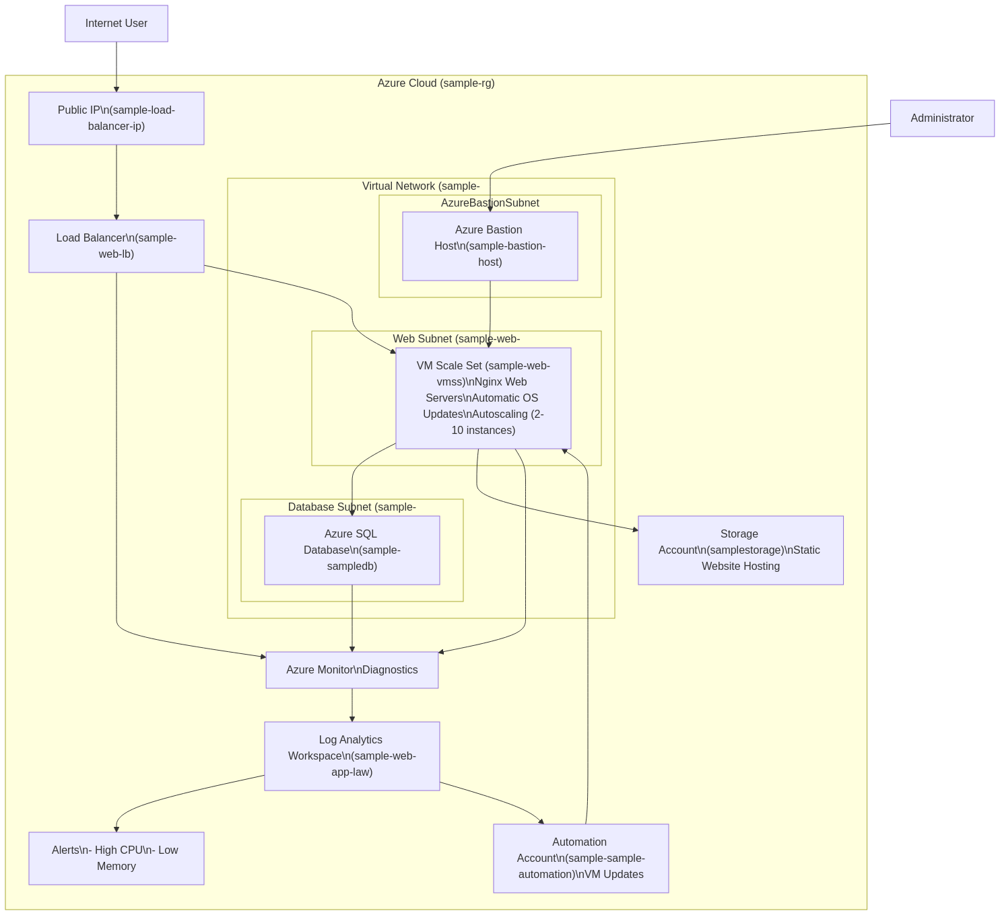

# Scalable and Secure Web Application on Azure

This project deploys a scalable, secure, and highly available web application on Azure using Infrastructure as Code (Terraform). The architecture follows Azure best practices and includes all components required for a production-ready environment.

## Architecture



The solution consists of the following components:

1. **Networking**: Virtual Network with separate subnets for web and database tiers, secured with Network Security Groups
2. **Compute**: Linux VM Scale Set with auto-scaling and a Load Balancer for high availability
3. **Database**: Azure SQL Database with secure access through VNet Service Endpoints
4. **Storage**: Azure Storage Account for static content with secure access
5. **Monitoring**: Azure Monitor, Log Analytics, and Application Insights for comprehensive monitoring
6. **Automation**: Azure Automation for automated VM updates and maintenance

## Prerequisites

- Azure Subscription
- Azure CLI
- Terraform
- SSH key pair for VM authentication

## Deployment Instructions

1. Clone this repository:
   ```bash
   git clone https://github.com/amelshood/azure-scalable-web-application.git
   cd azure-scalable-web-application
   ```

2. Initialize Terraform:
   ```bash
   terraform init
   ```

3. Create a `terraform.tfvars` file with your specific variables:
   ```hcl
   admin_cidr_block = <your-ip-address-cidr>   
   subscription_id = <subscription-id>
   admin_password = <admin-password>
   ssh_public_key_path = "~/.ssh/azure_key.pub"
   ```

4. Review the deployment plan:
   ```bash
   terraform plan
   ```

5. Deploy the infrastructure:
   ```bash
   terraform apply
   ```

6. Access your application:
   After deployment completes, the web application URL will be shown in the outputs. Open this URL in a web browser to access your application.

## Security Features

- Network Security Groups for each subnet with least-privilege access rules
- Azure SQL firewall rules limiting access to only the web subnet
- VNet Service Endpoints for secure database access
- Private network communication between tiers
- TLS enforcement for all connections
- Managed identities for secure access to Azure resources

## Monitoring and Operations

A comprehensive monitoring dashboard is deployed with:

- VM performance metrics (CPU, memory, disk, network)
- Database performance metrics
- Application insights
- Automated alerts for critical conditions
- Health checks and availability monitoring

Access the dashboard through the Azure Portal or via the URL provided in the deployment outputs.

## Scaling

The solution scales automatically based on the following configurations:

- VM Scale Set scales out when average CPU exceeds 75%
- VM Scale Set scales in when average CPU drops below 25%
- Min instances: 2, Max instances: 10

## CI/CD Integration (Future Enhancement)

This project can be integrated with CI/CD pipelines using Azure DevOps or GitHub Actions for:

- Automated testing of infrastructure changes
- Controlled deployment to development, staging, and production environments
- Application code deployment

## Cost Optimization

The solution is designed to optimize costs through:

- Auto-scaling to match resource usage with demand
- Appropriate VM sizes for the workload
- Usage of managed PaaS services where appropriate

## Backup and Disaster Recovery

- Azure SQL Database automatic backups
- VM Scale Set distributed across Availability Zones
- State recovery via Terraform state management

## License

[MIT](LICENSE)